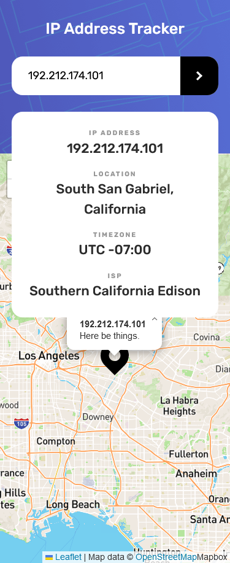
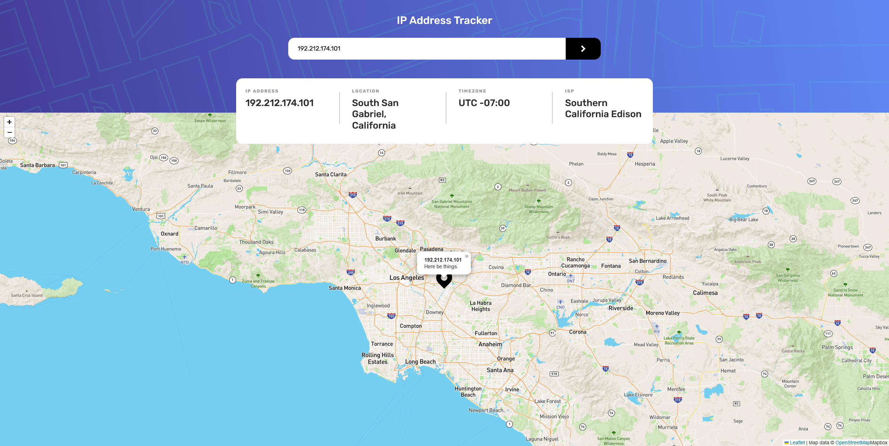

# Frontend Mentor - IP address tracker solution

This is a solution to the [IP address tracker challenge on Frontend Mentor](https://www.frontendmentor.io/challenges/ip-address-tracker-I8-0yYAH0). Frontend Mentor challenges help you improve your coding skills by building realistic projects.

## Table of contents

- [Overview](#overview)
  - [The challenge](#the-challenge)
  - [Screenshot](#screenshot)
  - [Links](#links)
- [My process](#my-process)
  - [Built with](#built-with)
  - [What I learned](#what-i-learned)
  - [Continued development](#continued-development)
  - [Useful resources](#useful-resources)
- [Author](#author)

## Overview

### The challenge

Users should be able to:

- View the optimal layout for each page depending on their device's screen size
- See hover states for all interactive elements on the page
- See their own IP address on the map on the initial page load
- Search for any IP addresses or domains and see the key information and location

### Screenshot

### Links

- Solution URL: [GitHub Repo](https://github.com/CallMe-AL/fementor-ip-tracker)
- Live Site URL: [Add live site URL here](https://your-live-site-url.com)

## My process

### Built with

- Semantic HTML5 markup
- CSS custom properties
- Flexbox
- Mobile-first workflow
- [Express](https://expressjs.com/) - Web framework for Node.js
- [IPify](https://geo.ipify.org/) - IP Geolocation API
- [Leaflet](https://leafletjs.com/) - JavaScript interactive map library
- [Mapbox](https://www.mapbox.com/) - Mapping API (used for tiles specifically)

### What I learned

This was my first time interacting with so many different APIs at once to make a project work! It was fun learning how the different pieces interact with each other to make a finished project. I also learned how expensive it can be to use certain APIs if one were to be making a much more large-scale, ambitious app.

I additionally brushed up on how to make an express server, the importance of CORS, and how to keep API keys hidden and secure.

### Continued development

I feel my code is mostly concise, but I'm always looking to improve on how to make it more organized or even more compact. I'm also curious to know of ways to further make API keys more secure when using a backend server, and how to speed up performance, as there's a slight lag for some requests to IPify.

### Useful resources

- [Express docs](https://expressjs.com/en/starter/hello-world.html) - Always useful to brush up on express, even the simple hello world example.
- [Leaflet docs](https://leafletjs.com/examples/quick-start/) - One of the many benefits of Leaflet is its open-source materiel. It's quick start is phenomenal help when getting going.
- [IPify docs](https://geo.ipify.org/docs) - Docs are good. We love docs. We love IPify's docs.

## Author

- Website - [Alex](https://callme-al.github.io/portfolio/)
- Frontend Mentor - [@CallMe-AL](https://www.frontendmentor.io/profile/CallMe-AL)
